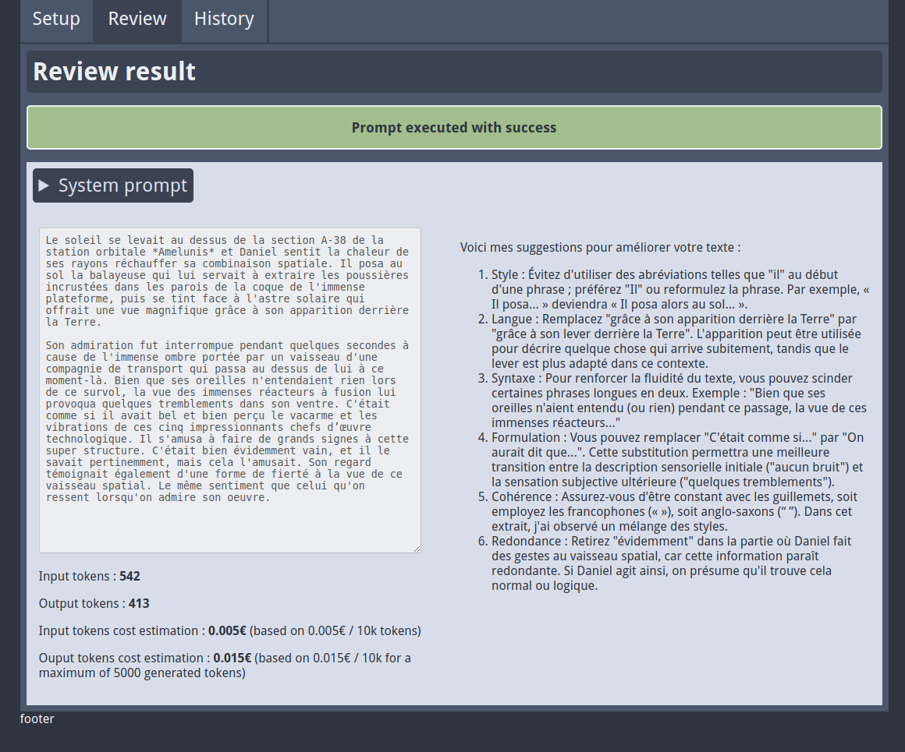

# ai-text-quality-reviewer

This code is merely a POC for using a generative AI LLM as a backend. Made to work with Infomaniak's LLM API (based on Mixtral).



This tool is a text quality reviewer designed to propose some fix on a text : spelling, writing quality, redundancy, check etc.

⚠️ This is an experimental product not intended for production, only for a local usage on your computer. There is no security embedded and your API key will be stored in plain text inside a local SQLite database. Use it at your own risks.

## Installation and startup

Clone repository, mount a Python virtualenv.

```bash
virtualenv venv
```

Install dependencies

```bash
pip install -r requirements.txt
```

Run application

```bash
python run.py
```

Go to http://127.0.0.1:5000

## Setup and usage

At startup the app will require some settings. You'll arrive on the Settings screen.

First, you need to define the system prompt. It's basically asking the model how it is expected to work. A default example is available, in French, hard-coded. You can change it, it will store de settings in a `settings.db` SQLite3 file.

The API Base URL should not be changed, it's Infomaniak's LLM API and this tool was made to work with it. The settings basically wrap-up the [provider's API](https://developer.infomaniak.com/docs/api/post/1/llm/%7Bproduct_id%7D).

The Product ID is the instance ID you have on your Manager space. The access token is... The access token you need to authenticate. Until you've saved the settings, it will be stored in the database. Pasting a new value will replace it.

The advanced settings are some params I've found interesting to manipulate. I won't recommend to use the model in Creative mode for the use-case covered by this tool. Strict had some weird responses, Standard seems quite good.

Once you've set the tool, go to the Review screen and paste some content.

You have two options. First, you can estimate the cost of your prompt using an internal tokenizer to estimate how many tokens your prompt will use. The output cost is based on the maximum output you've allowed. Currently the calculation is not working.

If you choose to send the prompt to the model, the page will hang until the response is provided. The input and output are stored in the sqlite database. You can review them in the History tab.


## License

MIT.
